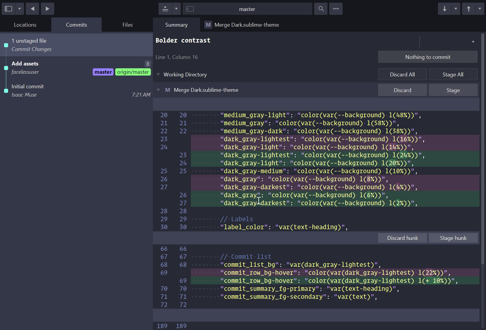
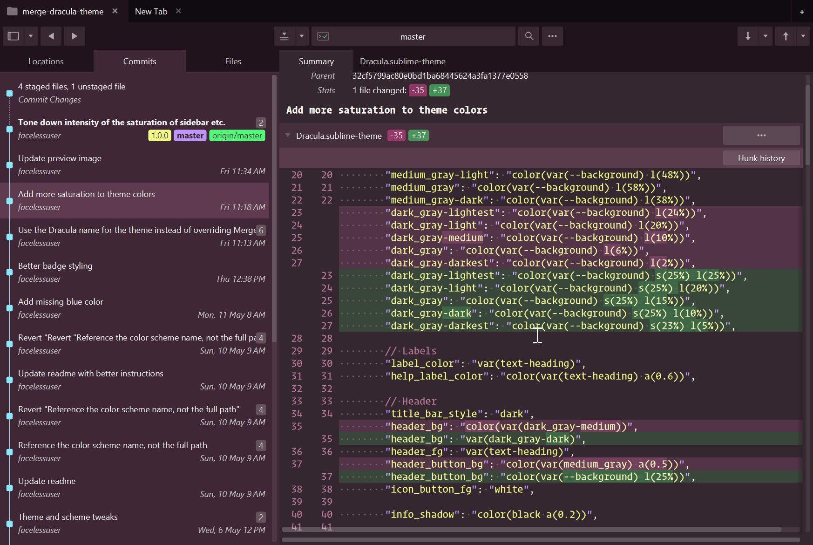
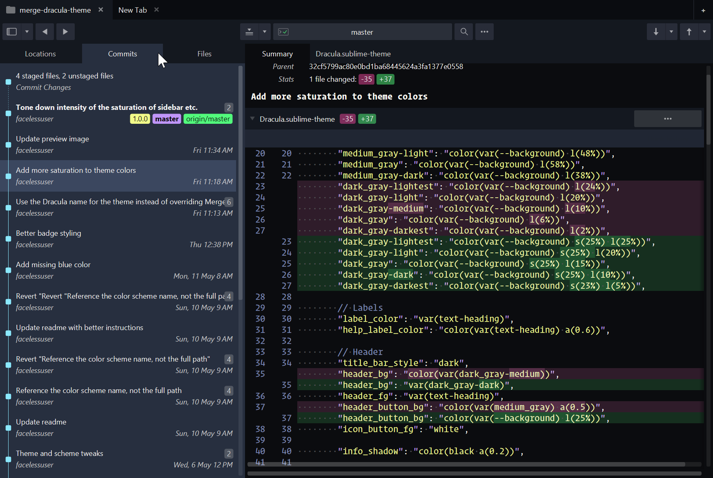

# Theme - Dracula

[Dracula](https://draculatheme.com/) theme for Sublime Merge 2.



## Install

Git clone project or download into your Sublime Merge `Packages` folder as `Theme - Dracula`. Edit your merge
`Preferences.sublime-settings` file to use the Dracula theme:

```js
    "theme": "Dracula.sublime-settings"
```

## Customize

Dracula Pro changed up the color palette a bit and added new variants such as Buffy, Van Helsing, and others. Dracula
Pro is also not free. Because of this, we only provide the "classic" Dracula palette.

We do not know what the Pro palette is, and though we could probably guess pretty close, we feel it is not appropriate
to publish such information even if we could identify it.

While we cannot provide the Pro theme palette or the pro theme variants, we have designed the color schemes to be pretty
customizable so you can create your own pro-ish style variants. Pro themes seem to have different backgrounds and
accents that adapt to those backgrounds. The rest of the palette seems to not change between variants. This theme's
color scheme uses the Classic color palette, but is designed in such a way that with a few simple overrides, you can
create your own Pro-ish style variants.

Simply override the background with the color of your choice, and create comments and selections that adapt based on
your background selection. You can create an override file using the name `Dracula.sublime-color-scheme` in your `User`
folder.

Want a pinkish theme? Plug in a pink hued background.

```js
{
    "variables": {
        // Create variants:
        //
        // This allows for theme specific variants like what is
        // possible for Dracula Pro. This scheme was developed
        // separately from Pro, and I do not own, nor have seen Pro's source.
        // We purposefully use the classic palette and not Pro's as we do not wish
        // to take away from the author's work. But this allows you to create Pro style
        // variants for classic:
        //
        //   - Change background to a suitable color and line highlights and accent
        //     colors will change accordingly.
        //   - Pro also changes comments based on background, if you'd like something more
        //     pro-ish, change comment's value to var(accent). And change selection to
        //     color(var(background) s(15%) l(30%))
        "background": "hsl(326, 15%, 18%)",
        "comment": "var(accent)",
        "selection": "color(var(background) s(15%) l(30%))"
    }
}
```



Want a darker theme? Plug in a darker background.

```js
{
    "variables": {
        // Create variants:
        //
        // This allows for theme specific variants like what is
        // possible for Dracula Pro. This scheme was developed
        // separately from Pro, and I do not own, nor have seen Pro's source.
        // We purposefully use the classic palette and not Pro's as we do not wish
        // to take away from the author's work. But this allows you to create Pro style
        // variants for classic:
        //
        //   - Change background to a suitable color and line highlights and accent
        //     colors will change accordingly.
        //   - Pro also changes comments based on background, if you'd like something more
        //     pro-ish, change comment's value to var(accent). And change selection to
        //     color(var(background) s(15%) l(30%))
        "background": "hsl(225, 15%, 5%)",
        "comment": "var(accent)",
        "selection": "color(var(background) s(15%) l(30%))"
    }
}
```



In the above examples we just plugged in some hues from the color palette and adjusted hue and saturation accordingly.
If you've purchased Dracula Pro and have the actual colors for the palette, and would like to update these schemes to
use the pro palette, simply override these variables with the Pro color palette and set the appropriate background. You
should get a Merge theme that provides a similar Pro experience.

```js
{
    "variables":
    {
        // Insert pro color palette
        "white": "hsl(60, 30%, 96%)",
        "red": "hsl(0, 100%, 67%)",
        "orange": "hsl(31, 100%, 71%)",
        "yellow": "hsl(65, 92%, 76%)",
        "green": "hsl(135, 94%, 65%)",
        "cyan": "hsl(191, 97%, 77%)",
        "blue": "hsl(225, 27%, 51%)",
        "pink": "hsl(326, 100%, 74%)",
        "purple": "hsl(265, 89%, 78%)",

        // Select appropriate Pro background color
        "background": "hsl(225, 15%, 5%)",
        "comment": "var(accent)",
        "selection": "color(var(background) s(15%) l(30%))"
    }
}
```

## Notes

We do not actually have to include the color scheme in this package if you were using the color scheme in Sublime Text.
Merge looks for color schemes (`.sublime-color-scheme`) in Sublime Text installs and uses those in Merge. Assuming they
contain the required Merge specific rules, they should work fine. So if you were using the color scheme in this package
already in Sublime Text, Merge would find it and use it making the inclusion here unnecessary, but it is included here
as a convenience.
